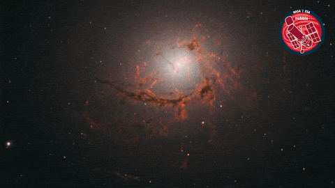

<!-- START_GIF -->

<!-- END_GIF -->
# 🌌 Independent Center for Space Research (ICSR)
> **Миссия центра:** Оцифровка теоретической астрофизики и вычислительной космологии. Перевод фундаментальных академических формул (от законов Джинса до тензорных моделей) в прецизионный открытый код на Python.

Мы выступаем за **Открытую науку (Open Science)** и верифицируемость результатов. Мы не усредняем Вселенную «оптом» на суперкомпьютерах — мы детально препарируем физику уникальных изолированных систем.

## 🔬 Ключевые направления исследований
* **Галактическая гидростатика 3D:** Учет трехмерного потенциала Миямото—Нагаи и эффекта раздувания дисков (*disk flaring*).
* **Парадоксы Местных войдов:** Проверка ограничений ΛCDM, MOND и скалярно-тензорных моделей гравитации на фильтре изолированных систем (CamB).
* **Фундаментальные парадоксы времени:** Моделирование квантовых эхо Пуанкаре и парадокса Лошмидта.

## 🛠️ Наш стек
`Python 3` • `NumPy` • `SciPy` • `Matplotlib` • `Jupyter Notebooks`

> **Парадокс современности:** Фундаментальные труды 1950-1970-х годов зачастую объясняют аномалии Вселенной глубже и точнее, чем современные «костыли» вроде тёмной материи, в поиск которой слепо вливаются миллиарды долларов. 

Мы в **Independent Center for Space Research (ICSR)** инициируем глобальный проект по пошаговой оцифровке классических астрофизических и физических учебников. Наша цель — перевести сухую бумажную математику титанов прошлого в понятный, открытый и верифицируемый код на Python.

## 🎯 Наша стратегия: От формулы к кнопке Shift+Enter
Мы берем классические книги, разбиваем их по главам и для каждого физического закона создаем:
1. **Универсальный Python-код:** Очищенный от академического пафоса, написанный понятным языком.
2. **Строгую систему СИ:** Никаких запутанных внесистемных допущений — все вычисления прозрачны и проверяемы.
3. **Автоматический селектор моделей:** Программа сама анализирует входные параметры (например, форму галактики) и выдает нужную математическую архитектуру.

## 📚 Какие направления мы берем в разработку (Спринт-карта)

### 📈 Блок 1: Динамика и гидростатика дисков (Текущий приоритет)
* **База:** Классические потенциалы (Миямото—Нагаи, Пламмер, уравнения Джинса).
* **Суть кода:** Моделирование сплюснутых трехмерных систем, учет эффекта раздувания дисков (*disk flaring*), расчет честных кривых вращения без привлечения скрытых масс.
* **Репозиторий:** `dwarf-galaxy-hydrostatics`

### ⏳ Блок 2: Фундаментальная термодинамика и стрела времени
* **База:** Теорема возвращения Пуанкаре (1890 г.), парадокс Лошмидта (1876 г.), статистическая механика Больцмана.
* **Суть кода:** Численное моделирование квантовых и классических эхо, расчет времени возврата систем в исходное состояние, демистификация «стрелы времени» через строгие алгоритмы.
* **Репозиторий:** `Poincare-Echo-Timer-Model-Loschmidt-II`

---
## 🚀 Последние обновления в репозиториях
<!--START_SECTION:activity-->
<!--END_SECTION:activity-->

---
